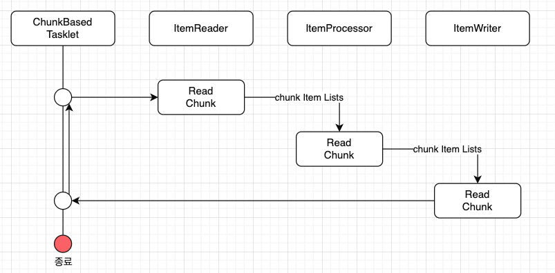
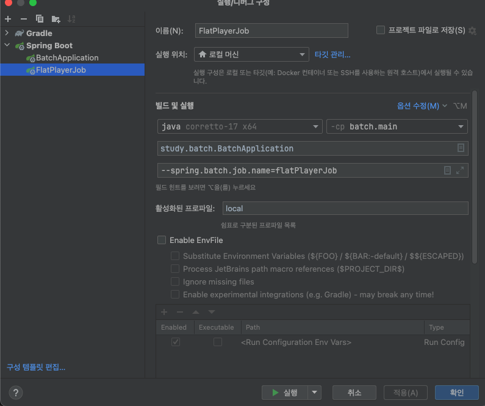

# 3주차 SPRING BATCH STUDY

## Chunk Model 알아보기

----
- Chunk Model은 처리할 데이터를 일정단위(청크)로 처리하는 방식
- ChunkOrientedTasklet은 청크 처리를 지원하는 Tasklet의 구체적인 클래스 역할을 수행
- 청크에 포함될 데이터의 최대 레코드 수(청크 Size)는 본 클래스의 commit-interval이라는 설정값을 이용하여 조정이 가능하다
- ItemReader, ItemProcessor, ItemWriter는 청크 단위를 처리하기 위한 인터페이스이다.
  
- ChunkOrientedTasklet은 ItemReader, ItemProcessor, ItemWriter 구현체를 각각 호출
- 청크 단위에 따라 ItemReader, ItemProcessor, ItemWriter를 반복 실행
- 청크 단위를 ItemProcessor로 전달하고, 데이터를 처리
- ItemProcessor를 처리하고 난 청크 단위가 ItemWriter로 전달되어 데이터를 저장하거나, 파일 처리를 수행한다.

## ItemProcessor

----
- ItemProcessor은 구체적인 구현체를 구현하여 스프링배치에 전달
- ItemProcessor은 Reader로 읽어들인 청크 데이터들을 처리한다.
- ItemProcessor는 chunk model에서 없어도 되는 옵션
```java
public class MyItemProcessor implements
      ItemProcessor<MyInputObject, MyOutputObject> {  // ItemProcessor 인터페이스를 구현하게 된다. 이때 입력, 출력 데이터 타입을 제네릭 타입으로 받음
  @Override
    public MyOutputObject process(MyInputObject item) throws Exception {  // process메소드 구현체를 구현하며, 입력 args를 받음

        MyOutputObject processedObject = new MyOutputObject();  // ItemProcessor 처리 결과로 반환할 출력 객체를 생성

        // Coding business logic for item of input data

    return processedObject; // 출력 객체를 반환
  }
}
```

## ItemReader
- ItemReader는 직접 커스텀 구현을 할 수 있지만 스프링배치에서는 이미 구현된 다양한 ItemReader 구현체를 제공

### 제공하는 다양한 구현체
- FlatFileItemReader
  - 사용 전 [FieildSet](https://docs.spring.io/spring-batch/reference/readers-and-writers/flat-files/field-set.html)이라는 클래스 확인
  - 플랫파일( 구조화 되지 않은 파일을 플랫파일이라고 한다. 대표적으로 csv파일 등이 있음)
  - 읽어들인 데이터를 객체로 매핑하기 위해서 delimeter를 기준으로 매핑 룰을 이용하여 객체롤 매핑
  - 입력에 대해서 Resource object를 이용하여 커스텀하게 매핑할 수도 있음
- StaxEventItemReader
  - XML파일을 읽어들인다.
  - XML파일을 stAX기반으로 읽어들인다.
    - stAX의 특징
      - Streaming 방식: 데이터를 한 번에 메모리에 올리는 대신, 스트림처럼 XML을 한 줄씩 처리
      - 이벤트 기반 처리: XML의 시작 태구, 끝 태그, 텍스트 등 중요한 부분이 이벤트로 발생하며, 이를 통해 개발자가 적절히 대응 가능
      - Pull 방식: 이벤트를 개발자가 명시적으로 요청. 필요할 때 데이터를 읽어들여 더 효율적으로 메모리를 사용할 수 있음
    - stAx의 장점
      - 메모리 사용 최적화: 스트리밍 방식으로 처리하여 메모리 부담을 최소화
      - 쓰기 지원: XML 데이터를 쓰는 기능도 제공하므로, 읽기와 쓰기를 모두 처리 가능
      - 개발자 제어 향상: Pull 방식으로 언제 데이터를 가져올지 개발자가 결정 가능
- JdbcPagingItemReader / JdbcCursorItemReader
  - JDBC를 사용하여 SQL을 실행하고 데이터베이스의 레코드를 읽는다.
  - 데이터베이스에서 많은 양의 데이터를 처리해야 하는 경우에는 메모리에 있는 모든 레코드를 읽는 것을 피하고, 한 번의 처리에 필요한 데이터만 읽고 폐기하는 것이 필요하다.
  - JdbcPagingItemReader는 JdbcTemplate을 이용하여 각 페이지에 대한 SELECT SQL을 나누어 처리하는 방식으로 구현된다.
  - 반면 JdbcCursorItemReader는 JDBC 커서를 이용하여 하나의 SELECT SQL을 발행하여 구현
  - | **항목**                | **JdbcPagingItemReader**                 | **JdbcCursorItemReader**                   |
    |------------------------|------------------------------------------|-------------------------------------------|
    | **방식**               | **페이징(Paging) 방식**으로 데이터 조회  | **커서(Cursor) 방식**으로 데이터 조회     |
    | **데이터 로딩**        | 여러 번에 걸쳐 쿼리 실행 (페이지 단위)   | 하나의 커서로 전체 데이터 조회            |
    | **메모리 사용**        | 각 페이지마다 메모리에 데이터 로드        | 필요 시점에 한 행씩 메모리에 로드         |
    | **성능 특성**          | 작은 페이지로 나눠 읽을 때 효율적        | 네트워크 비용은 적지만 커넥션을 오래 유지 |
    | **적용 추천 사례**     | 대용량 데이터를 나눠 처리해야 할 때      | 데이터가 크지 않고 지속적인 커넥션 사용이 가능할 때 |
    | **데이터 변경 처리**   | 데이터 변경에도 안정적으로 처리 가능     | 읽는 동안 데이터 변경이 있으면 문제 발생 가능 |
    - JdbcPagingItemReader
      - 장점
        - 데이터 변경에 안전. 다른 트랜잭션이 데이터를 수정해도 새로 쿼리를 실행하므로 최신 데이터를 반영할 수 있음
        - 네트워크 연결을 오래 유지하지 않으므로 커넥션 자원을 효율적으로 사용
      - 단점
        - 쿼리가 여러 번 실행되므로 쿼리 오버헤드가 발생할 수 있음
    - JdbcCursorItemReader
      - 커서 방식
        - 데이터베이스에서 쿼리를 실행한 후, 결과 집합을 한 번에 메모리에 올리지 않고 하나씩 순차적으로 읽는 방식
        - 데이터가 큰 경우 전체를 메모리에 적재하지 않아 메모리 사용을 절약할 수 있음
        - 커서가 열려 있는 동안 데이터베이스와 지속적으로 연결
      - 장점
        - 전체 데이터를 메모리에 로드하지 않으므로 메모리 부담이 적음
      - 단점
        - 데이터베이스와 커넥션을 오랫동안 유지
        - 커서를 열고 있는 동안 데이터가 변경되면 예상치 못한 결과를 가져올 수 있음
- MyBatisCursorItemReader / MyBatisPagingItemReader
  - MyBatis를 사용하여 데이터베이스의 레코드를 읽는다.
  - MyBatis가 제공하는 Spring 조정 라이브러리는 MyBatis-Spring에서 제공된다.
  - Pagin과 Cursor의 차이점은 MyBatis를 구현한 방법이 다를 뿐 JdbcXXXItemReader와 동일
  - 또한 ItemReaderJPA구현이나 Hibernate와 연동하여 데이터베이스의 레코드를 읽어오는 JpaPagingItemReader, HibernatePagingItemReader, HibernateCursor를 제공
- JmsItemReader / AmqpItemReader
  -  메시지를 JMS 혹은 AMQP에서 읽어들인다.

## ItemWriter
- ItemWriter의 다양한 구현체를 제공

### 제공하는 다양한 구현체
- FlatFileItemWriter
  - 처리된 Java객체를 CSV파일과 같은 플랫 파일로 작성한다.
  - 파일 라인에 대한 매핑 규칙은 구분 기호 및 개체에서 사용자 정의로 사용할 수도 있다.
- StaxEventWriter
  - XML파일로 자바 객체를 쓰기할 수 있다.
- JdbcBatchItemWriter
  - JDBC를 사용하여 SQL을 수행하고 자바 객체를 데이터베이스에 쓰기한다.
  - 내부적으로 JdbcTemplate를 사용함
- MyBatisBatchItemWriter
  - MyBatis를 사용하여 자바 객체를 데이터베이스로 씀
  - MyBatis-Spring는 MyBatis에서 제공되는 라이브러리를 이용한다.
- JmsItemWriter / AmqpItemWriter
  - JMS혹은 AMQP롤 자바 객체의 메시지를 전송

## Tasklet Model
- 청크 단위 처리가 맞지 않을 경우 Tasklet Model이 유용함
- 한번에 하나의 레코드만 읽어서 쓰기해야하는 경우 Tasklet Model이 적합
- 사용자는 Tasklet 모델을 사용하면서 Spring Batch에서 제공하는 Tasklet 인터페이스를 구현해야함

## Tasklet 구현클래스
- SystemCommandTasklet
  - 시스템 명령어를 비동기적으로 실행하는 Tasklet
  - 명령 속성에 수행해야할 명령어를 지정하여 사용 가능
  - 시스템 명령은 호출하는 ㅅ레드와 다른 스레드에 의해 실행되므로 프로세스 도중 타임아웃을 설정하고, 시스템 명령의 실행 스레드를 취소할 수 있음
- MethodInvokingTaskletAdaptor
  - POJO클래스의 특정 메소드를 실행하기 위함
  - targetObject 속성에 대상 클래스의 빈을 지정하고, targetMethod 속성에 실행할 메소드 이름을 지정
  - POJO 클래스는 일괄 처리 종료 상태를 메소드의 반환 값으로 반환이 가능하지만, 이경우 사실은 ExitStatus를 반환값으로 설정 필요
  - 다른 타임의 값이 반환될 경우 반환값과 상관없이 "정상 종료(ExitStatus:COMPLETED" 상태로 간주

## ItemReader / ItemProcessor / ItemWriter 테스트 해보기

---
- 아래와 같이 레알 마드리드 선수진의 목록이 있다.
- ```
  No,Name,Age
  1,Thibaut Courtois,32
  2,Dani Carvajal,32
  3,Fran García,25
  4,David Alaba,32
  5,Jude Bellingham,21
  6,Nacho Fernández,34
  7,Vinícius Júnior,24
  8,Toni Kroos,34
  9,Joselu,34
  10,Luka Modrić,39
  11,Rodrygo,23
  12,Eduardo Camavinga,21
  13,Andriy Lunin,25
  14,Aurélien Tchouaméni,24
  15,Ferland Mendy,29
  16,Antonio Rüdiger,31
  17,Brahim Díaz,25
  18,Álvaro Odriozola,28
  19,Dani Ceballos,28
  20,Fran García,25
  21,Borja Mayoral,27
  22,Kepa Arrizabalaga,30
  ```
- 1년이 지나 Age를 1더해줘야 한다고 가정 (한국나이로 계산)

### Player Class 정의
```java
package study.batch.week3;

import lombok.Getter;
import lombok.Setter;
import lombok.ToString;

import java.io.Serializable;

@Getter
@Setter
@ToString
public class Player implements Serializable {
    private long no;
    private String name;
    private int age;

}
```
### FieldSetMapper 설정
- CSV의 레코드를 Player Class에 넣어주기 위해서는 FieldSetMapper를 사용해야 하는데 2가지 방법이 존재
  - 1번째 레코드의 순서대로 정의하는 방법
    - ```java
      package study.batch.week3;

      import org.springframework.batch.item.file.mapping.FieldSetMapper;
      import org.springframework.batch.item.file.transform.FieldSet;
    
      public class PlayerFieldSetMapper implements FieldSetMapper<Player> {
      public Player mapFieldSet(FieldSet fs) {
        if (fs == null) return null;
  
            Player player = new Player();
  
            player.setNo(fs.readLong(0));
            player.setName(fs.readString(1));
            player.setAge(fs.readInt(2));
  
            return player;
        }
      }```
  - 2번째 레코드의 title을 보고 정의하는 방법
    - ```java 
      package study.batch.week3;

      import org.springframework.batch.item.file.mapping.FieldSetMapper;
      import org.springframework.batch.item.file.transform.FieldSet;
  
      public class PlayerMapper implements FieldSetMapper<Player> {
      public Player mapFieldSet(FieldSet fs) {
      if (fs == null) return null;
  
              Player player = new Player();
              player.setNo(fs.readLong("No"));
              player.setName(fs.readString("Name"));
              player.setAge(fs.readInt("Age"));
  
              return player;
          }
      }```
    해당 방법의 경우 delimitedLineTokenizer 추가 설정 반드시 필요

### 관련된 Bean 등록
```java
package study.batch.week3;

import lombok.extern.java.Log;
import org.springframework.batch.core.Job;
import org.springframework.batch.core.Step;
import org.springframework.batch.core.job.builder.JobBuilder;
import org.springframework.batch.core.launch.support.RunIdIncrementer;
import org.springframework.batch.core.repository.JobRepository;
import org.springframework.batch.core.step.builder.StepBuilder;
import org.springframework.batch.item.file.FlatFileItemReader;
import org.springframework.batch.item.file.builder.FlatFileItemReaderBuilder;
import org.springframework.batch.item.file.mapping.DefaultLineMapper;
import org.springframework.batch.item.file.mapping.FieldSetMapper;
import org.springframework.batch.item.file.transform.DelimitedLineTokenizer;
import org.springframework.context.annotation.Bean;
import org.springframework.context.annotation.Configuration;
import org.springframework.core.io.FileSystemResource;
import org.springframework.transaction.PlatformTransactionManager;


@Log
@Configuration
public class PlayerJobConfiguration {

    @Bean
    public FieldSetMapper<Player> playerFieldSetMapper() {
//        return new PlayerFieldSetMapper();
        return new PlayerMapper();
    }

    @Bean
    public DelimitedLineTokenizer delimitedLineTokenizer() {
        DelimitedLineTokenizer delimitedLineTokenizer = new DelimitedLineTokenizer();
        delimitedLineTokenizer.setNames("No", "Name", "Age");
        return delimitedLineTokenizer;
    }

    @Bean
    public DefaultLineMapper<Player> playerLineMapper() {
        DefaultLineMapper<Player> lineMapper = new DefaultLineMapper<> ();
        lineMapper.setLineTokenizer(delimitedLineTokenizer());
        lineMapper.setFieldSetMapper(playerFieldSetMapper());

        return lineMapper;
    }

    @Bean
    public FlatFileItemReader<Player> playerFlatFileItemReader() {
        return new FlatFileItemReaderBuilder<Player>()
                .name("playerFlatFileItemReader")
                .resource(new FileSystemResource("src/main/resources/week3/players.csv"))
                .linesToSkip(1) // 표의 title skip
                .lineMapper(playerLineMapper())
                .build();
    }

    @Bean
    public Step playerStep(JobRepository jobRepository, PlatformTransactionManager transactionManager) {
        log.info("------------------ Init PlayerStep -----------------");
        return new StepBuilder("flatPlayerStep", jobRepository)
                .<Player, Player>chunk(10, transactionManager)
                .reader(playerFlatFileItemReader())
                .processor(player -> {
                    log.info("------------------ Processor Execute ------------------");
                    player.setAge(player.getAge()+1);
                    return player;
                })
                .writer(chunk -> {
                    log.info("------------------ WRITE Execute ------------------");
                    chunk.getItems().forEach(item -> log.info(item.toString()));
                })
                .build();
    }

    @Bean
    public Job playerJob(Step playerStep, JobRepository jobRepository) {
        log.info("------------------ Init PlayerJob -----------------");
        return new JobBuilder("flatPlayerJob", jobRepository)
                .incrementer(new RunIdIncrementer())
                .start(playerStep)
                .build();
    }
}
``` 
- chunk size는 10
- ItemReader: 레알마드리드 선수진의 데이터를 불러옴
- ItemProcessor: 각 선수의 나이를 1 더함
- ItemWriter: 선수들의 데이터를 로그로 찍음
- processor와 writer는 간단한 작업으로 lambda 처리

**❗결과 확인❗** <br>
```
  .   ____          _            __ _ _
 /\\ / ___'_ __ _ _(_)_ __  __ _ \ \ \ \
( ( )\___ | '_ | '_| | '_ \/ _` | \ \ \ \
 \\/  ___)| |_)| | | | | || (_| |  ) ) ) )
  '  |____| .__|_| |_|_| |_\__, | / / / /
 =========|_|==============|___/=/_/_/_/

 :: Spring Boot ::                (v3.3.4)

2024-10-21T11:32:34.763+09:00  INFO 19549 --- [batch] [           main] study.batch.BatchApplication             : Starting BatchApplication using Java 17.0.9 with PID 19549 (/Users/1004781/study/spring/batch/build/classes/java/main started by 1004781 in /Users/1004781/study/spring/batch)
2024-10-21T11:32:34.768+09:00  INFO 19549 --- [batch] [           main] study.batch.BatchApplication             : The following 1 profile is active: "local"
2024-10-21T11:32:35.504+09:00  WARN 19549 --- [batch] [           main] trationDelegate$BeanPostProcessorChecker : Bean 'org.springframework.boot.autoconfigure.jdbc.DataSourceConfiguration$Hikari' of type [org.springframework.boot.autoconfigure.jdbc.DataSourceConfiguration$Hikari] is not eligible for getting processed by all BeanPostProcessors (for example: not eligible for auto-proxying). Is this bean getting eagerly injected into a currently created BeanPostProcessor [jobRegistryBeanPostProcessor]? Check the corresponding BeanPostProcessor declaration and its dependencies.
2024-10-21T11:32:35.539+09:00  WARN 19549 --- [batch] [           main] trationDelegate$BeanPostProcessorChecker : Bean 'spring.datasource-org.springframework.boot.autoconfigure.jdbc.DataSourceProperties' of type [org.springframework.boot.autoconfigure.jdbc.DataSourceProperties] is not eligible for getting processed by all BeanPostProcessors (for example: not eligible for auto-proxying). Is this bean getting eagerly injected into a currently created BeanPostProcessor [jobRegistryBeanPostProcessor]? Check the corresponding BeanPostProcessor declaration and its dependencies.
2024-10-21T11:32:35.541+09:00  WARN 19549 --- [batch] [           main] trationDelegate$BeanPostProcessorChecker : Bean 'org.springframework.boot.autoconfigure.jdbc.DataSourceAutoConfiguration$PooledDataSourceConfiguration' of type [org.springframework.boot.autoconfigure.jdbc.DataSourceAutoConfiguration$PooledDataSourceConfiguration] is not eligible for getting processed by all BeanPostProcessors (for example: not eligible for auto-proxying). Is this bean getting eagerly injected into a currently created BeanPostProcessor [jobRegistryBeanPostProcessor]? Check the corresponding BeanPostProcessor declaration and its dependencies.
2024-10-21T11:32:35.543+09:00  WARN 19549 --- [batch] [           main] trationDelegate$BeanPostProcessorChecker : Bean 'jdbcConnectionDetails' of type [org.springframework.boot.autoconfigure.jdbc.PropertiesJdbcConnectionDetails] is not eligible for getting processed by all BeanPostProcessors (for example: not eligible for auto-proxying). Is this bean getting eagerly injected into a currently created BeanPostProcessor [jobRegistryBeanPostProcessor]? Check the corresponding BeanPostProcessor declaration and its dependencies.
2024-10-21T11:32:35.569+09:00  WARN 19549 --- [batch] [           main] trationDelegate$BeanPostProcessorChecker : Bean 'dataSource' of type [com.zaxxer.hikari.HikariDataSource] is not eligible for getting processed by all BeanPostProcessors (for example: not eligible for auto-proxying). Is this bean getting eagerly injected into a currently created BeanPostProcessor [jobRegistryBeanPostProcessor]? Check the corresponding BeanPostProcessor declaration and its dependencies.
2024-10-21T11:32:35.585+09:00  WARN 19549 --- [batch] [           main] trationDelegate$BeanPostProcessorChecker : Bean 'basicTaskJobConfiguration' of type [study.batch.BasicTaskJobConfiguration$$SpringCGLIB$$0] is not eligible for getting processed by all BeanPostProcessors (for example: not eligible for auto-proxying). Is this bean getting eagerly injected into a currently created BeanPostProcessor [jobRegistryBeanPostProcessor]? Check the corresponding BeanPostProcessor declaration and its dependencies.
2024-10-21T11:32:35.590+09:00  WARN 19549 --- [batch] [           main] trationDelegate$BeanPostProcessorChecker : Bean 'transactionManager' of type [org.springframework.jdbc.datasource.DataSourceTransactionManager] is not eligible for getting processed by all BeanPostProcessors (for example: not eligible for auto-proxying). Is this bean getting eagerly injected into a currently created BeanPostProcessor [jobRegistryBeanPostProcessor]? Check the corresponding BeanPostProcessor declaration and its dependencies.
2024-10-21T11:32:35.593+09:00  WARN 19549 --- [batch] [           main] trationDelegate$BeanPostProcessorChecker : Bean 'spring.batch-org.springframework.boot.autoconfigure.batch.BatchProperties' of type [org.springframework.boot.autoconfigure.batch.BatchProperties] is not eligible for getting processed by all BeanPostProcessors (for example: not eligible for auto-proxying). Is this bean getting eagerly injected into a currently created BeanPostProcessor [jobRegistryBeanPostProcessor]? Check the corresponding BeanPostProcessor declaration and its dependencies.
2024-10-21T11:32:35.600+09:00  WARN 19549 --- [batch] [           main] trationDelegate$BeanPostProcessorChecker : Bean 'org.springframework.boot.autoconfigure.batch.BatchAutoConfiguration$SpringBootBatchConfiguration' of type [org.springframework.boot.autoconfigure.batch.BatchAutoConfiguration$SpringBootBatchConfiguration] is not eligible for getting processed by all BeanPostProcessors (for example: not eligible for auto-proxying). The currently created BeanPostProcessor [jobRegistryBeanPostProcessor] is declared through a non-static factory method on that class; consider declaring it as static instead.
2024-10-21T11:32:35.610+09:00  INFO 19549 --- [batch] [           main] study.batch.jobs.task01.GreetingTask     : ----------------------- After Properties Set() -----------------------
2024-10-21T11:32:35.633+09:00  INFO 19549 --- [batch] [           main] com.zaxxer.hikari.HikariDataSource       : HikariPool-1 - Starting...
2024-10-21T11:32:36.076+09:00  INFO 19549 --- [batch] [           main] com.zaxxer.hikari.pool.HikariPool        : HikariPool-1 - Added connection com.mysql.cj.jdbc.ConnectionImpl@78cd163b
2024-10-21T11:32:36.079+09:00  INFO 19549 --- [batch] [           main] com.zaxxer.hikari.HikariDataSource       : HikariPool-1 - Start completed.
2024-10-21T11:32:36.137+09:00  INFO 19549 --- [batch] [           main] study.batch.BasicTaskJobConfiguration    : ------------------ Init myStep -----------------
2024-10-21T11:32:36.158+09:00  INFO 19549 --- [batch] [           main] study.batch.BasicTaskJobConfiguration    : ------------------ Init myJob -----------------
2024-10-21T11:32:36.173+09:00  INFO 19549 --- [batch] [           main] s.batch.week3.PlayerJobConfiguration     : ------------------ Init PlayerStep -----------------
2024-10-21T11:32:36.187+09:00  INFO 19549 --- [batch] [           main] s.batch.week3.PlayerJobConfiguration     : ------------------ Init PlayerJob -----------------
2024-10-21T11:32:36.285+09:00  WARN 19549 --- [batch] [           main] s.c.a.AnnotationConfigApplicationContext : Exception encountered during context initialization - cancelling refresh attempt: org.springframework.beans.factory.BeanCreationException: Error creating bean with name 'jobLauncherApplicationRunner' defined in class path resource [org/springframework/boot/autoconfigure/batch/BatchAutoConfiguration.class]: Job name must be specified in case of multiple jobs
2024-10-21T11:32:36.286+09:00  INFO 19549 --- [batch] [           main] com.zaxxer.hikari.HikariDataSource       : HikariPool-1 - Shutdown initiated...
2024-10-21T11:32:36.340+09:00  INFO 19549 --- [batch] [           main] com.zaxxer.hikari.HikariDataSource       : HikariPool-1 - Shutdown completed.
2024-10-21T11:32:36.348+09:00  INFO 19549 --- [batch] [           main] .s.b.a.l.ConditionEvaluationReportLogger : 

Error starting ApplicationContext. To display the condition evaluation report re-run your application with 'debug' enabled.
2024-10-21T11:32:36.363+09:00 ERROR 19549 --- [batch] [           main] o.s.boot.SpringApplication               : Application run failed

org.springframework.beans.factory.BeanCreationException: Error creating bean with name 'jobLauncherApplicationRunner' defined in class path resource [org/springframework/boot/autoconfigure/batch/BatchAutoConfiguration.class]: Job name must be specified in case of multiple jobs
	at org.springframework.beans.factory.support.AbstractAutowireCapableBeanFactory.initializeBean(AbstractAutowireCapableBeanFactory.java:1806) ~[spring-beans-6.1.13.jar:6.1.13]
	at org.springframework.beans.factory.support.AbstractAutowireCapableBeanFactory.doCreateBean(AbstractAutowireCapableBeanFactory.java:600) ~[spring-beans-6.1.13.jar:6.1.13]
	at org.springframework.beans.factory.support.AbstractAutowireCapableBeanFactory.createBean(AbstractAutowireCapableBeanFactory.java:522) ~[spring-beans-6.1.13.jar:6.1.13]
	at org.springframework.beans.factory.support.AbstractBeanFactory.lambda$doGetBean$0(AbstractBeanFactory.java:337) ~[spring-beans-6.1.13.jar:6.1.13]
	at org.springframework.beans.factory.support.DefaultSingletonBeanRegistry.getSingleton(DefaultSingletonBeanRegistry.java:234) ~[spring-beans-6.1.13.jar:6.1.13]
	at org.springframework.beans.factory.support.AbstractBeanFactory.doGetBean(AbstractBeanFactory.java:335) ~[spring-beans-6.1.13.jar:6.1.13]
	at org.springframework.beans.factory.support.AbstractBeanFactory.getBean(AbstractBeanFactory.java:200) ~[spring-beans-6.1.13.jar:6.1.13]
	at org.springframework.beans.factory.support.DefaultListableBeanFactory.preInstantiateSingletons(DefaultListableBeanFactory.java:975) ~[spring-beans-6.1.13.jar:6.1.13]
	at org.springframework.context.support.AbstractApplicationContext.finishBeanFactoryInitialization(AbstractApplicationContext.java:971) ~[spring-context-6.1.13.jar:6.1.13]
	at org.springframework.context.support.AbstractApplicationContext.refresh(AbstractApplicationContext.java:625) ~[spring-context-6.1.13.jar:6.1.13]
	at org.springframework.boot.SpringApplication.refresh(SpringApplication.java:754) ~[spring-boot-3.3.4.jar:3.3.4]
	at org.springframework.boot.SpringApplication.refreshContext(SpringApplication.java:456) ~[spring-boot-3.3.4.jar:3.3.4]
	at org.springframework.boot.SpringApplication.run(SpringApplication.java:335) ~[spring-boot-3.3.4.jar:3.3.4]
	at org.springframework.boot.SpringApplication.run(SpringApplication.java:1363) ~[spring-boot-3.3.4.jar:3.3.4]
	at org.springframework.boot.SpringApplication.run(SpringApplication.java:1352) ~[spring-boot-3.3.4.jar:3.3.4]
	at study.batch.BatchApplication.main(BatchApplication.java:10) ~[main/:na]
Caused by: java.lang.IllegalArgumentException: Job name must be specified in case of multiple jobs
	at org.springframework.util.Assert.isTrue(Assert.java:111) ~[spring-core-6.1.13.jar:6.1.13]
	at org.springframework.boot.autoconfigure.batch.JobLauncherApplicationRunner.afterPropertiesSet(JobLauncherApplicationRunner.java:115) ~[spring-boot-autoconfigure-3.3.4.jar:3.3.4]
	at org.springframework.beans.factory.support.AbstractAutowireCapableBeanFactory.invokeInitMethods(AbstractAutowireCapableBeanFactory.java:1853) ~[spring-beans-6.1.13.jar:6.1.13]
	at org.springframework.beans.factory.support.AbstractAutowireCapableBeanFactory.initializeBean(AbstractAutowireCapableBeanFactory.java:1802) ~[spring-beans-6.1.13.jar:6.1.13]
	... 15 common frames omitted


종료 코드 1(으)로 완료된 프로세스
```
**❗아래 에러로 인하여 실행 불가능❗** <br>
```
org.springframework.beans.factory.BeanCreationException: Error creating bean with name 'jobLauncherApplicationRunner' defined in class path resource [org/springframework/boot/autoconfigure/batch/BatchAutoConfiguration.class]: Job name must be specified in case of multiple jobs
```
**❓원인이 무엇일까❓** <br>
- Spring Batch 5는 엄격한 설정과 명시적인 구성 방식을 요구
- 이전 버전에서는 여러 Job이 컨텍스트에 등록되어 있어도, 특정 Job을 지정하지 않으면 첫 번째 등록된 Job이 자동으로 실행되었음 (5버전도 하나의 Job이 등록된 상황이면 바로 실행)
- Spring Batch 5에서는 자동 실행 방지 및 명확한 Job 선택을 강제하여 실수와 혼란을 줄이고, 더 나은 확장성과 관리성을 제공
- | **기능**                       | **Spring Batch 4.x 이하**                | **Spring Batch 5.x**                        |
  |--------------------------------|------------------------------------------|---------------------------------------------|
  | 여러 Job 등록 시 실행 방식     | 첫 번째 등록된 Job이 자동 실행됨        | 명시적으로 실행할 Job을 지정해야 함        |
  | 실행 시 Job 이름 명시 여부     | 선택 사항 (지정 안 해도 기본 실행 가능) | 필수 (여러 Job 등록 시 반드시 지정해야 함) |
  | Strictness 강화                | 자동 실행으로 유연성 제공                | 명확성, 일관성을 위한 엄격한 제약 추가     |
- 결론 : 전에 Tasklet 테스트로 만들어 놨던 Job과 새로 만든 Job이 컨텍스트에 등록되어 있지만 어떤 Job을 실행할지 명시하지 않았기 때문에 발생

**❗해결법❗** <br>
- 어떤 Job을 실행하고 싶은지 명시해주면 됨
- 예시)
  - 
  
**❗다시 결과 확인❗** <br>
```
  .   ____          _            __ _ _
 /\\ / ___'_ __ _ _(_)_ __  __ _ \ \ \ \
( ( )\___ | '_ | '_| | '_ \/ _` | \ \ \ \
 \\/  ___)| |_)| | | | | || (_| |  ) ) ) )
  '  |____| .__|_| |_|_| |_\__, | / / / /
 =========|_|==============|___/=/_/_/_/

 :: Spring Boot ::                (v3.3.4)

2024-10-21T13:06:37.122+09:00  INFO 23934 --- [batch] [           main] study.batch.BatchApplication             : Starting BatchApplication using Java 17.0.9 with PID 23934 (/Users/1004781/study/spring/batch/build/classes/java/main started by 1004781 in /Users/1004781/study/spring/batch)
2024-10-21T13:06:37.124+09:00  INFO 23934 --- [batch] [           main] study.batch.BatchApplication             : The following 1 profile is active: "local"
2024-10-21T13:06:37.910+09:00  WARN 23934 --- [batch] [           main] trationDelegate$BeanPostProcessorChecker : Bean 'org.springframework.boot.autoconfigure.jdbc.DataSourceConfiguration$Hikari' of type [org.springframework.boot.autoconfigure.jdbc.DataSourceConfiguration$Hikari] is not eligible for getting processed by all BeanPostProcessors (for example: not eligible for auto-proxying). Is this bean getting eagerly injected into a currently created BeanPostProcessor [jobRegistryBeanPostProcessor]? Check the corresponding BeanPostProcessor declaration and its dependencies.
2024-10-21T13:06:37.948+09:00  WARN 23934 --- [batch] [           main] trationDelegate$BeanPostProcessorChecker : Bean 'spring.datasource-org.springframework.boot.autoconfigure.jdbc.DataSourceProperties' of type [org.springframework.boot.autoconfigure.jdbc.DataSourceProperties] is not eligible for getting processed by all BeanPostProcessors (for example: not eligible for auto-proxying). Is this bean getting eagerly injected into a currently created BeanPostProcessor [jobRegistryBeanPostProcessor]? Check the corresponding BeanPostProcessor declaration and its dependencies.
2024-10-21T13:06:37.950+09:00  WARN 23934 --- [batch] [           main] trationDelegate$BeanPostProcessorChecker : Bean 'org.springframework.boot.autoconfigure.jdbc.DataSourceAutoConfiguration$PooledDataSourceConfiguration' of type [org.springframework.boot.autoconfigure.jdbc.DataSourceAutoConfiguration$PooledDataSourceConfiguration] is not eligible for getting processed by all BeanPostProcessors (for example: not eligible for auto-proxying). Is this bean getting eagerly injected into a currently created BeanPostProcessor [jobRegistryBeanPostProcessor]? Check the corresponding BeanPostProcessor declaration and its dependencies.
2024-10-21T13:06:37.953+09:00  WARN 23934 --- [batch] [           main] trationDelegate$BeanPostProcessorChecker : Bean 'jdbcConnectionDetails' of type [org.springframework.boot.autoconfigure.jdbc.PropertiesJdbcConnectionDetails] is not eligible for getting processed by all BeanPostProcessors (for example: not eligible for auto-proxying). Is this bean getting eagerly injected into a currently created BeanPostProcessor [jobRegistryBeanPostProcessor]? Check the corresponding BeanPostProcessor declaration and its dependencies.
2024-10-21T13:06:37.985+09:00  WARN 23934 --- [batch] [           main] trationDelegate$BeanPostProcessorChecker : Bean 'dataSource' of type [com.zaxxer.hikari.HikariDataSource] is not eligible for getting processed by all BeanPostProcessors (for example: not eligible for auto-proxying). Is this bean getting eagerly injected into a currently created BeanPostProcessor [jobRegistryBeanPostProcessor]? Check the corresponding BeanPostProcessor declaration and its dependencies.
2024-10-21T13:06:38.003+09:00  WARN 23934 --- [batch] [           main] trationDelegate$BeanPostProcessorChecker : Bean 'basicTaskJobConfiguration' of type [study.batch.BasicTaskJobConfiguration$$SpringCGLIB$$0] is not eligible for getting processed by all BeanPostProcessors (for example: not eligible for auto-proxying). Is this bean getting eagerly injected into a currently created BeanPostProcessor [jobRegistryBeanPostProcessor]? Check the corresponding BeanPostProcessor declaration and its dependencies.
2024-10-21T13:06:38.008+09:00  WARN 23934 --- [batch] [           main] trationDelegate$BeanPostProcessorChecker : Bean 'transactionManager' of type [org.springframework.jdbc.datasource.DataSourceTransactionManager] is not eligible for getting processed by all BeanPostProcessors (for example: not eligible for auto-proxying). Is this bean getting eagerly injected into a currently created BeanPostProcessor [jobRegistryBeanPostProcessor]? Check the corresponding BeanPostProcessor declaration and its dependencies.
2024-10-21T13:06:38.013+09:00  WARN 23934 --- [batch] [           main] trationDelegate$BeanPostProcessorChecker : Bean 'spring.batch-org.springframework.boot.autoconfigure.batch.BatchProperties' of type [org.springframework.boot.autoconfigure.batch.BatchProperties] is not eligible for getting processed by all BeanPostProcessors (for example: not eligible for auto-proxying). Is this bean getting eagerly injected into a currently created BeanPostProcessor [jobRegistryBeanPostProcessor]? Check the corresponding BeanPostProcessor declaration and its dependencies.
2024-10-21T13:06:38.021+09:00  WARN 23934 --- [batch] [           main] trationDelegate$BeanPostProcessorChecker : Bean 'org.springframework.boot.autoconfigure.batch.BatchAutoConfiguration$SpringBootBatchConfiguration' of type [org.springframework.boot.autoconfigure.batch.BatchAutoConfiguration$SpringBootBatchConfiguration] is not eligible for getting processed by all BeanPostProcessors (for example: not eligible for auto-proxying). The currently created BeanPostProcessor [jobRegistryBeanPostProcessor] is declared through a non-static factory method on that class; consider declaring it as static instead.
2024-10-21T13:06:38.032+09:00  INFO 23934 --- [batch] [           main] study.batch.jobs.task01.GreetingTask     : ----------------------- After Properties Set() -----------------------
2024-10-21T13:06:38.054+09:00  INFO 23934 --- [batch] [           main] com.zaxxer.hikari.HikariDataSource       : HikariPool-1 - Starting...
2024-10-21T13:06:38.936+09:00  INFO 23934 --- [batch] [           main] com.zaxxer.hikari.pool.HikariPool        : HikariPool-1 - Added connection com.mysql.cj.jdbc.ConnectionImpl@44e93c1f
2024-10-21T13:06:38.940+09:00  INFO 23934 --- [batch] [           main] com.zaxxer.hikari.HikariDataSource       : HikariPool-1 - Start completed.
2024-10-21T13:06:39.005+09:00  INFO 23934 --- [batch] [           main] study.batch.BasicTaskJobConfiguration    : ------------------ Init myStep -----------------
2024-10-21T13:06:39.025+09:00  INFO 23934 --- [batch] [           main] study.batch.BasicTaskJobConfiguration    : ------------------ Init myJob -----------------
2024-10-21T13:06:39.041+09:00  INFO 23934 --- [batch] [           main] s.batch.week3.PlayerJobConfiguration     : ------------------ Init PlayerStep -----------------
2024-10-21T13:06:39.057+09:00  INFO 23934 --- [batch] [           main] s.batch.week3.PlayerJobConfiguration     : ------------------ Init PlayerJob -----------------
2024-10-21T13:06:39.277+09:00  INFO 23934 --- [batch] [           main] study.batch.BatchApplication             : Started BatchApplication in 2.616 seconds (process running for 3.551)
2024-10-21T13:06:39.279+09:00  INFO 23934 --- [batch] [           main] o.s.b.a.b.JobLauncherApplicationRunner   : Running default command line with: []
2024-10-21T13:06:39.796+09:00  INFO 23934 --- [batch] [           main] o.s.b.c.l.support.SimpleJobLauncher      : Job: [SimpleJob: [name=flatPlayerJob]] launched with the following parameters: [{'run.id':'{value=31, type=class java.lang.Long, identifying=true}'}]
2024-10-21T13:06:40.055+09:00  INFO 23934 --- [batch] [           main] o.s.batch.core.job.SimpleStepHandler     : Executing step: [flatPlayerStep]
2024-10-21T13:06:40.194+09:00  INFO 23934 --- [batch] [           main] s.batch.week3.PlayerJobConfiguration     : ------------------ Processor Execute ------------------
2024-10-21T13:06:40.194+09:00  INFO 23934 --- [batch] [           main] s.batch.week3.PlayerJobConfiguration     : ------------------ Processor Execute ------------------
2024-10-21T13:06:40.195+09:00  INFO 23934 --- [batch] [           main] s.batch.week3.PlayerJobConfiguration     : ------------------ Processor Execute ------------------
2024-10-21T13:06:40.195+09:00  INFO 23934 --- [batch] [           main] s.batch.week3.PlayerJobConfiguration     : ------------------ Processor Execute ------------------
2024-10-21T13:06:40.195+09:00  INFO 23934 --- [batch] [           main] s.batch.week3.PlayerJobConfiguration     : ------------------ Processor Execute ------------------
2024-10-21T13:06:40.195+09:00  INFO 23934 --- [batch] [           main] s.batch.week3.PlayerJobConfiguration     : ------------------ Processor Execute ------------------
2024-10-21T13:06:40.195+09:00  INFO 23934 --- [batch] [           main] s.batch.week3.PlayerJobConfiguration     : ------------------ Processor Execute ------------------
2024-10-21T13:06:40.195+09:00  INFO 23934 --- [batch] [           main] s.batch.week3.PlayerJobConfiguration     : ------------------ Processor Execute ------------------
2024-10-21T13:06:40.195+09:00  INFO 23934 --- [batch] [           main] s.batch.week3.PlayerJobConfiguration     : ------------------ Processor Execute ------------------
2024-10-21T13:06:40.195+09:00  INFO 23934 --- [batch] [           main] s.batch.week3.PlayerJobConfiguration     : ------------------ Processor Execute ------------------
2024-10-21T13:06:40.195+09:00  INFO 23934 --- [batch] [           main] s.batch.week3.PlayerJobConfiguration     : ------------------ WRITE Execute ------------------
2024-10-21T13:06:40.199+09:00  INFO 23934 --- [batch] [           main] s.batch.week3.PlayerJobConfiguration     : Player(no=1, name=Thibaut Courtois, age=33)
2024-10-21T13:06:40.201+09:00  INFO 23934 --- [batch] [           main] s.batch.week3.PlayerJobConfiguration     : Player(no=2, name=Dani Carvajal, age=33)
2024-10-21T13:06:40.202+09:00  INFO 23934 --- [batch] [           main] s.batch.week3.PlayerJobConfiguration     : Player(no=3, name=Fran García, age=26)
2024-10-21T13:06:40.202+09:00  INFO 23934 --- [batch] [           main] s.batch.week3.PlayerJobConfiguration     : Player(no=4, name=David Alaba, age=33)
2024-10-21T13:06:40.202+09:00  INFO 23934 --- [batch] [           main] s.batch.week3.PlayerJobConfiguration     : Player(no=5, name=Jude Bellingham, age=22)
2024-10-21T13:06:40.202+09:00  INFO 23934 --- [batch] [           main] s.batch.week3.PlayerJobConfiguration     : Player(no=6, name=Nacho Fernández, age=35)
2024-10-21T13:06:40.202+09:00  INFO 23934 --- [batch] [           main] s.batch.week3.PlayerJobConfiguration     : Player(no=7, name=Vinícius Júnior, age=25)
2024-10-21T13:06:40.202+09:00  INFO 23934 --- [batch] [           main] s.batch.week3.PlayerJobConfiguration     : Player(no=8, name=Toni Kroos, age=35)
2024-10-21T13:06:40.202+09:00  INFO 23934 --- [batch] [           main] s.batch.week3.PlayerJobConfiguration     : Player(no=9, name=Joselu, age=35)
2024-10-21T13:06:40.202+09:00  INFO 23934 --- [batch] [           main] s.batch.week3.PlayerJobConfiguration     : Player(no=10, name=Luka Modrić, age=40)
2024-10-21T13:06:40.277+09:00  INFO 23934 --- [batch] [           main] s.batch.week3.PlayerJobConfiguration     : ------------------ Processor Execute ------------------
2024-10-21T13:06:40.277+09:00  INFO 23934 --- [batch] [           main] s.batch.week3.PlayerJobConfiguration     : ------------------ Processor Execute ------------------
2024-10-21T13:06:40.277+09:00  INFO 23934 --- [batch] [           main] s.batch.week3.PlayerJobConfiguration     : ------------------ Processor Execute ------------------
2024-10-21T13:06:40.277+09:00  INFO 23934 --- [batch] [           main] s.batch.week3.PlayerJobConfiguration     : ------------------ Processor Execute ------------------
2024-10-21T13:06:40.277+09:00  INFO 23934 --- [batch] [           main] s.batch.week3.PlayerJobConfiguration     : ------------------ Processor Execute ------------------
2024-10-21T13:06:40.277+09:00  INFO 23934 --- [batch] [           main] s.batch.week3.PlayerJobConfiguration     : ------------------ Processor Execute ------------------
2024-10-21T13:06:40.277+09:00  INFO 23934 --- [batch] [           main] s.batch.week3.PlayerJobConfiguration     : ------------------ Processor Execute ------------------
2024-10-21T13:06:40.277+09:00  INFO 23934 --- [batch] [           main] s.batch.week3.PlayerJobConfiguration     : ------------------ Processor Execute ------------------
2024-10-21T13:06:40.277+09:00  INFO 23934 --- [batch] [           main] s.batch.week3.PlayerJobConfiguration     : ------------------ Processor Execute ------------------
2024-10-21T13:06:40.278+09:00  INFO 23934 --- [batch] [           main] s.batch.week3.PlayerJobConfiguration     : ------------------ Processor Execute ------------------
2024-10-21T13:06:40.278+09:00  INFO 23934 --- [batch] [           main] s.batch.week3.PlayerJobConfiguration     : ------------------ WRITE Execute ------------------
2024-10-21T13:06:40.278+09:00  INFO 23934 --- [batch] [           main] s.batch.week3.PlayerJobConfiguration     : Player(no=11, name=Rodrygo, age=24)
2024-10-21T13:06:40.280+09:00  INFO 23934 --- [batch] [           main] s.batch.week3.PlayerJobConfiguration     : Player(no=12, name=Eduardo Camavinga, age=22)
2024-10-21T13:06:40.280+09:00  INFO 23934 --- [batch] [           main] s.batch.week3.PlayerJobConfiguration     : Player(no=13, name=Andriy Lunin, age=26)
2024-10-21T13:06:40.281+09:00  INFO 23934 --- [batch] [           main] s.batch.week3.PlayerJobConfiguration     : Player(no=14, name=Aurélien Tchouaméni, age=25)
2024-10-21T13:06:40.281+09:00  INFO 23934 --- [batch] [           main] s.batch.week3.PlayerJobConfiguration     : Player(no=15, name=Ferland Mendy, age=30)
2024-10-21T13:06:40.281+09:00  INFO 23934 --- [batch] [           main] s.batch.week3.PlayerJobConfiguration     : Player(no=16, name=Antonio Rüdiger, age=32)
2024-10-21T13:06:40.281+09:00  INFO 23934 --- [batch] [           main] s.batch.week3.PlayerJobConfiguration     : Player(no=17, name=Brahim Díaz, age=26)
2024-10-21T13:06:40.281+09:00  INFO 23934 --- [batch] [           main] s.batch.week3.PlayerJobConfiguration     : Player(no=18, name=Álvaro Odriozola, age=29)
2024-10-21T13:06:40.281+09:00  INFO 23934 --- [batch] [           main] s.batch.week3.PlayerJobConfiguration     : Player(no=19, name=Dani Ceballos, age=29)
2024-10-21T13:06:40.281+09:00  INFO 23934 --- [batch] [           main] s.batch.week3.PlayerJobConfiguration     : Player(no=20, name=Fran García, age=26)
2024-10-21T13:06:40.339+09:00  INFO 23934 --- [batch] [           main] s.batch.week3.PlayerJobConfiguration     : ------------------ Processor Execute ------------------
2024-10-21T13:06:40.340+09:00  INFO 23934 --- [batch] [           main] s.batch.week3.PlayerJobConfiguration     : ------------------ Processor Execute ------------------
2024-10-21T13:06:40.340+09:00  INFO 23934 --- [batch] [           main] s.batch.week3.PlayerJobConfiguration     : ------------------ WRITE Execute ------------------
2024-10-21T13:06:40.340+09:00  INFO 23934 --- [batch] [           main] s.batch.week3.PlayerJobConfiguration     : Player(no=21, name=Borja Mayoral, age=28)
2024-10-21T13:06:40.340+09:00  INFO 23934 --- [batch] [           main] s.batch.week3.PlayerJobConfiguration     : Player(no=22, name=Kepa Arrizabalaga, age=31)
2024-10-21T13:06:40.435+09:00  INFO 23934 --- [batch] [           main] o.s.batch.core.step.AbstractStep         : Step: [flatPlayerStep] executed in 379ms
2024-10-21T13:06:40.931+09:00  INFO 23934 --- [batch] [           main] o.s.b.c.l.support.SimpleJobLauncher      : Job: [SimpleJob: [name=flatPlayerJob]] completed with the following parameters: [{'run.id':'{value=31, type=class java.lang.Long, identifying=true}'}] and the following status: [COMPLETED] in 763ms
2024-10-21T13:06:40.964+09:00  INFO 23934 --- [batch] [ionShutdownHook] com.zaxxer.hikari.HikariDataSource       : HikariPool-1 - Shutdown initiated...
2024-10-21T13:06:41.073+09:00  INFO 23934 --- [batch] [ionShutdownHook] com.zaxxer.hikari.HikariDataSource       : HikariPool-1 - Shutdown completed.
```
- ItemReader는 한번에 10개씩 읽어옴
- ItemProcessor는 읽어온 데이터를 각 10번 실행함
- ItemWriter는 10개의 데이터를 한번에 처리 (Age값이 csv파일와 비교하였을 때보다 1 늘어난 것을 볼 수 있음 )

## 참조
- https://devocean.sk.com/blog/techBoardDetail.do?ID=166694&boardType=techBlog
- https://docs.spring.io/spring-batch/reference/readers-and-writers/flat-files.html


