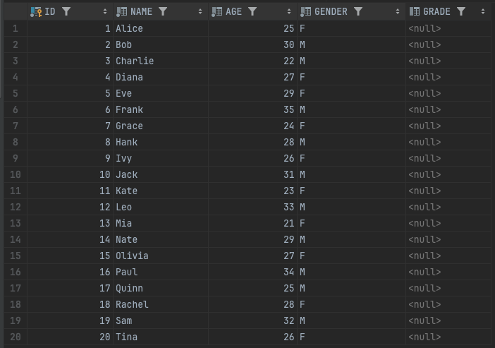
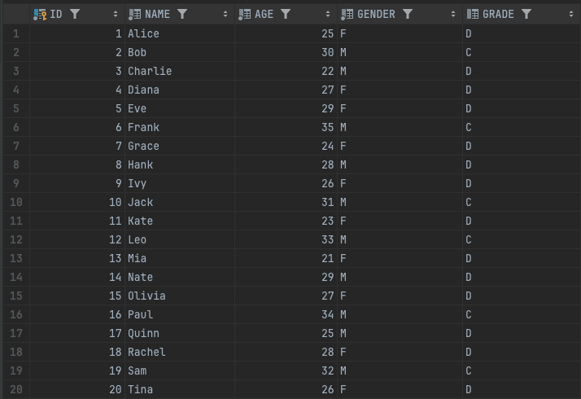

# 5주차 SPRING BATCH STUDY
- JdbcPagingItemReader로 DB 내용을 읽고, JdbcBatchItemWriter로 DB에 쓰기

## JdbcPagingItemReader개요

---
- JdbcPagingItemReader는 Spring Batch에서 제공하는 ItemReader로, 데이터베이스로부터 데이터를 페이지 단위로 읽음
- 대규모 데이터 처리 효율성: 메모리 사용량을 최소화하고 커밋 간격을 설정하여 대규모 데이터를 효율적으로 처리할 수 있음
- 쿼리 최적화: SQL 쿼리를 직접 작성하여 최적화된 데이터 읽기가 가능
- 커서 제어: 데이터베이스 커서를 사용하여 데이터 순회를 제어할 수 있음

## JdbcPagingItemReader 주요 구성 요소

---
- DataSource: 데이터베이스 연결 정보를 설정
- SqlQuery: 데이터를 읽을 SQL 쿼리를 설정
- RowMapper: SQL 쿼리 결과를 Item으로 변환하는 역할
- PageSize: 페이지 크기를 설정
- SkippableItemReader: 오류 발생 시 해당 Item을 건너뛸 수 있도록 함
- ReadListener: 읽기 시작, 종료, 오류 발생 등의 이벤트를 처리할 수 있도록 함
- SaveStateCallback: 잡 중단 시 현재 상태를 저장하여 재시작 시 이어서 처리할 수 있도록 함

## JdbcBatchItemWriter 개요

---
- JdbcBatchItemWriter Spring Batch에서 제공하는 ItemWriter 인터페이스를 구현하는 클래스
- 데이터를 JDBC를 통해 데이터베이스에 저장하는 데 사용

## JdbcBatchItemWriter 구성 요소

---
- DataSource: 데이터베이스 연결 정보를 지정
- SqlStatementCreator: 쿼리를 생성하는 역할
- PreparedStatementSetter: 쿼리의 파라미터 값을 설정하는 역할
- ItemSqlParameterSourceProvider: Item 객체를 기반으로 PreparedStatementSetter에 전달할 파라미터 값을 생성하는 역할

### 장점
- 데이터베이스 연동: JDBC를 통해 다양한 데이터베이스에 데이터를 저장할 수 있다.
- 성능: 대량의 데이터를 빠르게 저장 가능
- 유연성: 다양한 설정을 통해 원하는 방식으로 데이터를 저장

### 단점
- 설정 복잡성: JDBC 설정 및 쿼리 작성이 복잡할 수 있음
- 데이터베이스 종속: 특정 데이터베이스에 종속적
- 오류 가능성: 설정 오류 시 데이터 손상 가능성

## JdbcPagingItemReader / JdbcPagingItemWriter 사용해보기
### 실습을 위한 사전 구성
CUSTOMER 테이블 구성
```
create table CUSTOMER
(
    ID     int auto_increment
        primary key,
    NAME   varchar(20) not null,
    AGE    int         not null,
    GENDER varchar(1)  not null,
    GRADE  varchar(1)  null
);
```
데이터 삽입
```
INSERT INTO CUSTOMER (ID, NAME, AGE, GENDER) VALUES
                                                 (1, 'Alice', 25, 'F'),
                                                 (2, 'Bob', 30, 'M'),
                                                 (3, 'Charlie', 22, 'M'),
                                                 (4, 'Diana', 27, 'F'),
                                                 (5, 'Eve', 29, 'F'),
                                                 (6, 'Frank', 35, 'M'),
                                                 (7, 'Grace', 24, 'F'),
                                                 (8, 'Hank', 28, 'M'),
                                                 (9, 'Ivy', 26, 'F'),
                                                 (10, 'Jack', 31, 'M'),
                                                 (11, 'Kate', 23, 'F'),
                                                 (12, 'Leo', 33, 'M'),
                                                 (13, 'Mia', 21, 'F'),
                                                 (14, 'Nate', 29, 'M'),
                                                 (15, 'Olivia', 27, 'F'),
                                                 (16, 'Paul', 34, 'M'),
                                                 (17, 'Quinn', 25, 'M'),
                                                 (18, 'Rachel', 28, 'F'),
                                                 (19, 'Sam', 32, 'M'),
                                                 (20, 'Tina', 26, 'F');
```
테이블 데이터 확인



### 실습 요건
```
회원 등급 그룹에 대한 기획 요건이 추가되어 새롭게 등록을 해주어야 한다.
요건
- 50대 이상: A
- 40대 이상: B
- 30대 이상: C
- 30대 미만: D
```

### Customer 클래스 생성
```java
import lombok.Getter;
import lombok.Setter;
import lombok.ToString;

@Getter
@Setter
@ToString
public class Customer {
    private  int id;
    private String name;
    private int age;
    private Grade grade;

    public enum Grade {
        A, B, C, D
    }

    public String getGrade() {
        return grade.toString();
    }

    public void assignGroup() {
        if (50 <= age) {
            grade = Grade.A;
        } else if (40 <= age) {
            grade = Grade.B;
        } else if (30 <= age) {
            grade = Grade.C;
        } else {
            grade = Grade.D;
        }
    }
}
```

### 쿼리 Provider 작성
```java
    @Bean
    public PagingQueryProvider queryProvider() throws Exception {
        SqlPagingQueryProviderFactoryBean queryProvider = new SqlPagingQueryProviderFactoryBean();
        queryProvider.setDataSource(dataSource);
        queryProvider.setSelectClause("ID, NAME, AGE, GENDER");
        queryProvider.setFromClause("from CUSTOMER");
        queryProvider.setWhereClause("where AGE >= :age"); // 실습 요건을 충족에는 조건절 설정을 하지 않아도 되지만 학습을 위해서 설정

        Map<String, Order> sortKeys = new HashMap<>();
        sortKeys.put("id", Order.DESCENDING);

        queryProvider.setSortKeys(sortKeys);

        return queryProvider.getObject();
    }
```
- SqlPagingQueryProviderFactoryBean: 쿼리 프로바이더를 생성하는 팩토리
- setDataSource: 데이터소스 설정
- setSelectClause: select에서 프로젝션할 필드 이름 지정
- setFromClause: 조회할 테이블
- setWhereClause: 조건절
- setSortKeys: sort key 지정

### 전체 코드 작성
```java
@Log
@Configuration
public class CustomerJdbcJobConfiguration {
    private static final String CUSTOMER_JDBC_JOB = "customerJdbcJob";
    private static final String CUSTOMER_JDBC_STEP = "customerJdbcStep";
    private static final String CUSTOMER_JDBC_READER = "customerJdbcReader";
    private static final int CHUNK_SIZE = 10;

    @Autowired
    DataSource dataSource;

    @Bean
    public PagingQueryProvider queryProvider() throws Exception {
        SqlPagingQueryProviderFactoryBean queryProvider = new SqlPagingQueryProviderFactoryBean();
        queryProvider.setDataSource(dataSource);
        queryProvider.setSelectClause("ID, NAME, AGE, GENDER");
        queryProvider.setFromClause("from CUSTOMER");
        queryProvider.setWhereClause("where AGE >= :age");

        Map<String, Order> sortKeys = new HashMap<>();
        sortKeys.put("id", Order.DESCENDING);

        queryProvider.setSortKeys(sortKeys);

        return queryProvider.getObject();
    }

    @Bean
    public JdbcPagingItemReader<Customer> customerJdbcPagingItemReader() throws Exception {
        Map<String, Object> parameterValue = new HashMap<>();
        parameterValue.put("age",20);

        return new JdbcPagingItemReaderBuilder<Customer>()
                .name(CUSTOMER_JDBC_READER)
                .fetchSize(CHUNK_SIZE)
                .dataSource(dataSource)
                .rowMapper(new BeanPropertyRowMapper<>(Customer.class))
                .parameterValues(parameterValue)
                .queryProvider(queryProvider())
                .build();
    }

    @Bean
    public JdbcBatchItemWriter<Customer> customerJdbcBatchItemWriter() {
        return new JdbcBatchItemWriterBuilder<Customer>()
                .dataSource(dataSource)
                .sql("UPDATE CUSTOMER SET GRADE = :grade where ID = :id")
                .itemSqlParameterSourceProvider(BeanPropertySqlParameterSource::new)
                .build();
    }

    @Bean
    public Step customerJdbcPagingStep(JobRepository jobRepository, PlatformTransactionManager transactionManager) throws Exception {
        log.info("------------------ Init customerJdbcPagingStep -----------------");

        return new StepBuilder(CUSTOMER_JDBC_STEP, jobRepository)
                .<Customer, Customer>chunk(CHUNK_SIZE, transactionManager)
                .reader(customerJdbcPagingItemReader())
                .processor(customer -> {
                    customer.assignGroup();
                    return customer;
                })
                .writer(customerJdbcBatchItemWriter())
                .build();
    }

    @Bean
    public Job customerJdbcPaginJob(Step customerJdbcPagingStep, JobRepository jobRepository) {
        log.info("------------------ Init customerJdbcPagingJob -----------------");
        return new JobBuilder(CUSTOMER_JDBC_JOB, jobRepository)
                .incrementer(new RunIdIncrementer())
                .start(customerJdbcPagingStep)
                .build();

    }
}
```
- reader를 통해 customer 데이터를 읽음
- processor를 통해 요건에 맞게 데이터 프로세싱
- writer에서 DB에 변경된 데이터 적재

SqlParameterSource란?
- SpringBatch와 SpringJdbc에서 SQL 쿼리 실행 시 필요한 파라미터를 설정할 때 사용하는 인터페이스
- 쿼리 파라미터를 명시적으로 제공하며 SQL 실행시 파라미터 값을 매핑할 수 있도록 지원
- 주요 구현체로는 MapSqlParameterSource / BeanPropertySqlParameterSource / EmptySqlParameterSource 가 있음
  - MapSqlParameterSource
    - 파라미터를 Map형태로 저장하여 사용
    - 키-값을 사용해 파라미터를 추가할 수 있어 유연성이 높ㅇ므
    - ```
        MapSqlParameterSource params = new MapSqlParameterSource();
        params.addValue("name", "Alice");
        params.addValue("age", 30);
      ```       
  - BeanPropertySqlParameterSource
    - Java Bean의 프로퍼티를 통해 자동으로 매핑
    - 객체의 필드명을 기반으로 파라미터를 설정 -> 객체 지향적인 접근 방식에 적합
    - ```
      Customer customer = new Customer("Alice", 30);
      BeanPropertySqlParameterSource params = new BeanPropertySqlParameterSource(customer);
      ```
  - EmptySqlParameterSource
    - 파라미터가 필요하지 않은 경우 사용
    - 단순히 빈 파라미터를 전달할 때 유용

### Job 실행 결과 확인


### Ref
- https://devocean.sk.com/blog/techBoardDetail.do
